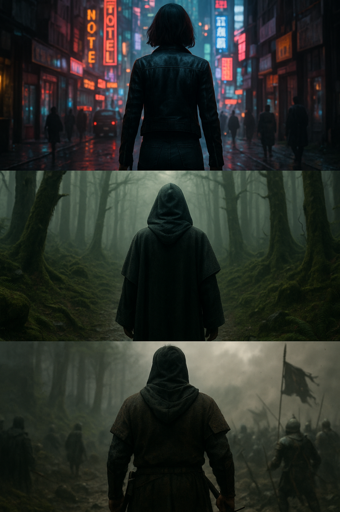
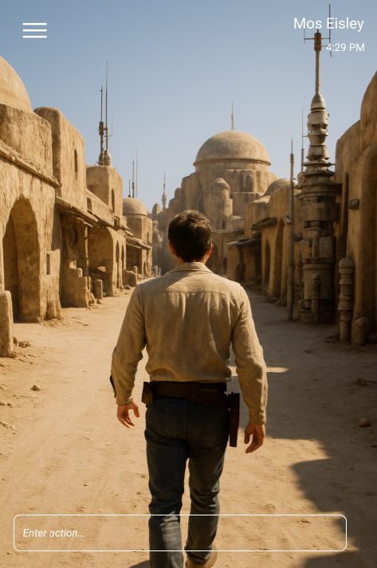
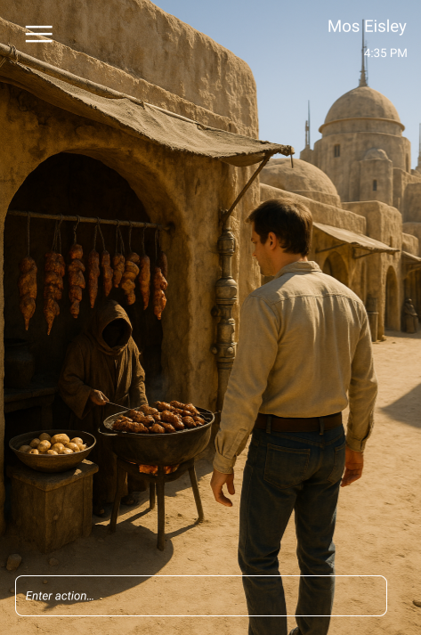

<h1>Worlds.ai: A Multi-Platform App to Create and Explore AI-Generated Worlds</h1>

  
   
  <em>Figure 1: The cover image for Worlds.ai.</em>

<h2>How it Works</h2>

<h3>World Creation</h3>

In Worlds.ai, users can create a world by going to the "Create" page and specifying a what they want their world to look like. 

<h4>Description</h4>

The user can describe what the world should look like. For example, they might say "An 11th century medieval battlefield".

<h4>Style</h4>

The user can describe what style the world should have. For example, they might use words like "dark, gritty". 

<h4>Character</h4>

The user can describe what kind of character they want to act as in the world. For example, they might say "a hooded man with a sword". 

<h3>World Exploration</h3>

The AI-based image generator will use all of the user's settings to generate plausible first-person POV's of their character
in the world. The generator starts with a base image, and then the user can type out the action they want to take, and then 
the generator, using the previous image and the action, will generate the next image the user sees. This continues indefinitely.

<h3>Example Gameplay: "the city of Mos Eisley from Star Wars"</h3>

  
   
  <em></em>

<h4>The user enters the following action: "I go to a street food vendor."</h4>

  
   
  <em>Image 1</em>

<h4>..."</h4>
